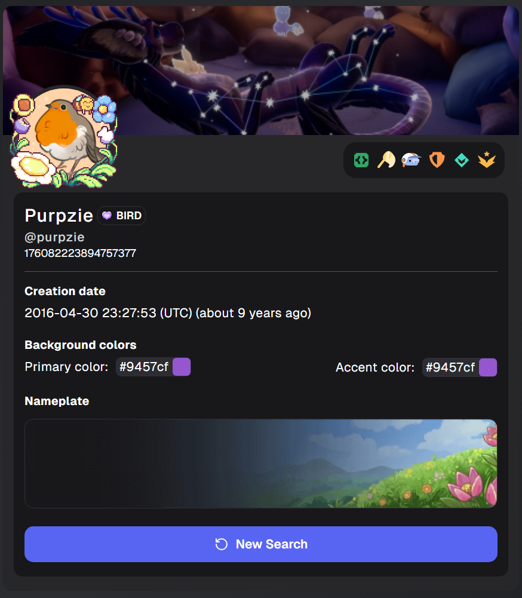

# discord-lookup 

**next.js** app that auto-generates `/user/[id]` & `/api/user/[id]` pages from discord user IDs & API to fetch user infos.

---

## ⚠️ known issues

- Some badges cannot be retrieved yet because the bitwise values for these badges have not been implemented.

---

## 🛠 environment variables

make sure to add a `.env.local` file at the root of the project with:

```env
# DISCORD BOT TOKEN
BOT_TOKEN="MT52MDAzOD2C1OD24y........"
```

---


## 🚀 getting started


```bash
npm install
npm run dev

npm run build
npm run start
```

then open [http://localhost:3000](http://localhost:3000)

---

To view a Discord user's profile, simply append their user ID to the URL path `/user/[id]`. For example:
```
/user/219034569607741440
```




---

## 📦 example API response

when you query `/api/user/[id]`, the API returns a JSON object with the following Discord user information:

```json
{
  "id": "176082223894757377",
  "discriminator": "0",
  "username": "purpzie",
  "global_name": "Purpzie",
  "created_at": "2016-04-30T21:27:53.626Z",
  "avatar": {
    "id": "3219a518c1c3c94032fc7bc17478efe3",
    "link": "https://cdn.discordapp.com/avatars/176082223894757377/3219a518c1c3c94032fc7bc17478efe3.webp?size=512",
    "animated": false
  },
  "banner": {
    "id": "48977963e0302dc1e76172cd69f3cfe8",
    "link": "https://cdn.discordapp.com/banners/176082223894757377/48977963e0302dc1e76172cd69f3cfe8?size=480",
    "animated": false,
    "color": "#9457cf",
    "accent_color": "#9457cf"
  },
  "badges": [
    {
      "name": "Active Developer",
      "icon": "http://localhost:3000/assets/images/icons/discord/badges/general/activedeveloper.svg",
      "description": "Own at least 1 active application executed in the last 30 days.",
      "bitwise": 4194304
    },
    {
      "name": "Discord Bug Hunter (Tier 2)",
      "icon": "http://localhost:3000/assets/images/icons/discord/badges/general/discordbughunter2.svg",
      "description": "Bug Hunter Level 2",
      "bitwise": 16384
    },
    {
      "name": "Early Supporter",
      "icon": "http://localhost:3000/assets/images/icons/discord/badges/general/discordearlysupporter.svg",
      "description": "Had a successful transaction before October 10, 2018.",
      "bitwise": 512
    },
    {
      "name": "Moderator Programs Alumni",
      "icon": "http://localhost:3000/assets/images/icons/discord/badges/general/discordmod.svg",
      "description": "No longer obtainable after Dec 1, 2022.",
      "bitwise": 262144
    },
    {
      "name": "HypeSquad Balance",
      "icon": "http://localhost:3000/assets/images/icons/discord/badges/general/hypesquadbalance.svg",
      "description": "HypeSquad Balance house member.",
      "bitwise": 256
    },
    {
      "name": "HypeSquad Events",
      "icon": "http://localhost:3000/assets/images/icons/discord/badges/general/hypesquadevents.svg",
      "description": "HypeSquad event attendance (closed, no longer obtainable).",
      "bitwise": 4
    }
  ],
  "bot": {
    "is_bot": false,
    "verified": false
  },
  "collectibles": {
    "nameplate": {
      "sku_id": "1349849614173339688",
      "asset": "nameplates/nameplates/spirit_of_spring/",
      "label": "COLLECTIBLES_NAMEPLATES_SPIRIT_OF_SPRING_A11Y",
      "palette": "sky",
      "link": "https://cdn.discordapp.com/assets/collectibles/nameplates/nameplates/spirit_of_spring/asset.webm"
    },
    "avatar_decoration": {
      "asset": "a_8de95a1173704216bf5f6ce7f1221bcf",
      "sku_id": "1369434230672588820",
      "expires_at": null,
      "link": "https://cdn.discordapp.com/avatar-decoration-presets/a_8de95a1173704216bf5f6ce7f1221bcf?size=512"
    }
  },
  "guild": {
    "identity_guild_id": "368499635674808331",
    "identity_enabled": true,
    "tag": "BIRD",
    "badge": "08d043e6049403c3a22eac95bd38a104",
    "link": "https://cdn.discordapp.com/clan-badges/368499635674808331/08d043e6049403c3a22eac95bd38a104.png"
  },
  "raw": {
    "id": "176082223894757377",
    "username": "purpzie",
    "avatar": "3219a518c1c3c94032fc7bc17478efe3",
    "discriminator": "0",
    "public_flags": 4473604,
    "flags": 4473604,
    "banner": "48977963e0302dc1e76172cd69f3cfe8",
    "accent_color": 9721807,
    "global_name": "Purpzie",
    "avatar_decoration_data": {
      "asset": "a_8de95a1173704216bf5f6ce7f1221bcf",
      "sku_id": "1369434230672588820",
      "expires_at": null
    },
    "collectibles": {
      "nameplate": {
        "sku_id": "1349849614173339688",
        "asset": "nameplates/nameplates/spirit_of_spring/",
        "label": "COLLECTIBLES_NAMEPLATES_SPIRIT_OF_SPRING_A11Y",
        "palette": "sky"
      }
    },
    "display_name_styles": null,
    "banner_color": "#9457cf",
    "clan": {
      "identity_guild_id": "368499635674808331",
      "identity_enabled": true,
      "tag": "BIRD",
      "badge": "08d043e6049403c3a22eac95bd38a104"
    },
    "primary_guild": {
      "identity_guild_id": "368499635674808331",
      "identity_enabled": true,
      "tag": "BIRD",
      "badge": "08d043e6049403c3a22eac95bd38a104"
    }
  }
}
```
