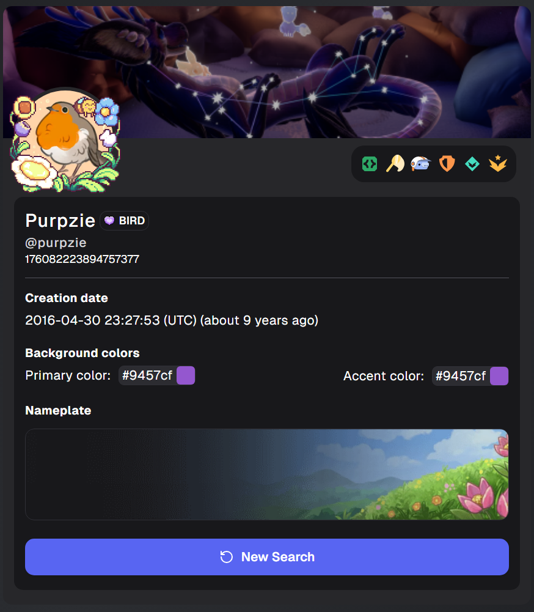

# Discord Lookup

A fast, modern Discord user lookup tool built with Next.js 16. Enter any Discord user ID to instantly view their profile — avatar, banner, badges, collectibles, clan tag, and creation date.



## Features

- Profile card with avatar, banner (animated support), and avatar decorations
- Badge detection via Discord's bitwise `public_flags` (Staff, Partner, HypeSquad, Bug Hunter, Active Developer, etc.)
- Nitro subscription detection via `premium_type`
- Collectibles display — nameplates (video) and avatar decorations
- Clan/guild tag display
- Account creation date from snowflake ID
- Banner & accent color display with click-to-copy
- User ID click-to-copy
- Dynamic OpenGraph metadata for link previews
- Full API endpoint at `/api/user/[id]`

## Tech Stack

- **Next.js 16** (App Router, Turbopack)
- **React 19**
- **TypeScript**
- **Tailwind CSS 4**
- **Radix UI** (Tooltips, Labels)
- **Zod** + **React Hook Form** (validation)

## Getting Started

### 1. Clone & install

```bash
git clone https://github.com/190km/discord-lookup.git
cd discord-lookup
npm install
```

### 2. Configure environment

Copy the example and add your Discord bot token:

```bash
cp .env.example .env
```

```env
BOT_TOKEN="your-discord-bot-token"
NEXT_PUBLIC_APP_URL="http://localhost:3000"
```

You need a Discord bot token. Create one at [discord.com/developers](https://discord.com/developers/applications).

### 3. Run

```bash
npm run dev
```

Open [http://localhost:3000](http://localhost:3000).

For production:

```bash
npm run build
npm start
```

## API

### `GET /api/user/[id]`

Returns a structured JSON object for any Discord user by snowflake ID.

**Example:** `/api/user/176082223894757377`

```json
{
  "id": "176082223894757377",
  "username": "purpzie",
  "global_name": "Purpzie",
  "discriminator": "0",
  "created_at": "2016-04-30T21:27:53.626Z",
  "avatar": {
    "id": "3219a518c1c3c94032fc7bc17478efe3",
    "link": "https://cdn.discordapp.com/avatars/.../3219a518c1c3c94032fc7bc17478efe3.webp?size=512",
    "animated": false
  },
  "banner": {
    "id": "48977963e0302dc1e76172cd69f3cfe8",
    "link": "https://cdn.discordapp.com/banners/...?size=1024",
    "animated": false,
    "color": "#9457cf",
    "accent_color": "#9457cf"
  },
  "badges": [
    { "name": "Active Developer", "bitwise": 4194304 },
    { "name": "HypeSquad Balance", "bitwise": 256 }
  ],
  "bot": { "is_bot": false, "verified": false },
  "collectibles": {
    "nameplate": { "label": "...", "link": "https://cdn.discordapp.com/assets/collectibles/..." },
    "avatar_decoration": { "link": "https://cdn.discordapp.com/avatar-decoration-presets/..." }
  },
  "guild": {
    "tag": "BIRD",
    "link": "https://cdn.discordapp.com/clan-badges/..."
  }
}
```

**Error responses:**

| Status | Reason |
|--------|--------|
| 400 | Invalid ID format (not 17-20 digits) |
| 404 | User not found |
| 500 | Internal server error |

## Project Structure

```
src/
├── app/
│   ├── api/user/[id]/route.ts    # Discord API proxy
│   ├── user/[id]/page.tsx        # Profile page (SSR)
│   └── page.tsx                  # Homepage
├── components/discord/
│   ├── lookup.tsx                # Search form
│   ├── user-card.tsx             # Profile card
│   ├── avatar.tsx                # Avatar + decoration
│   ├── banner.tsx                # Banner image/color
│   ├── badges.tsx                # Badge icons + tooltips
│   ├── infos.tsx                 # Username, ID, bot status
│   ├── colors.tsx                # Color swatches
│   ├── nameplate.tsx             # Nameplate video
│   └── tag.tsx                   # Clan tag
├── lib/
│   ├── badges.ts                 # Badge registry (bitwise flags)
│   ├── fetch-user.ts             # Client-side API wrapper
│   ├── snowflake.ts              # Snowflake ID → timestamp
│   ├── user.ts                   # CDN URL builders
│   └── utils.ts                  # Helpers (color, date, cn)
└── config/
    ├── site.ts                   # Site metadata
    └── fonts.ts                  # Font imports
```

## License

MIT
